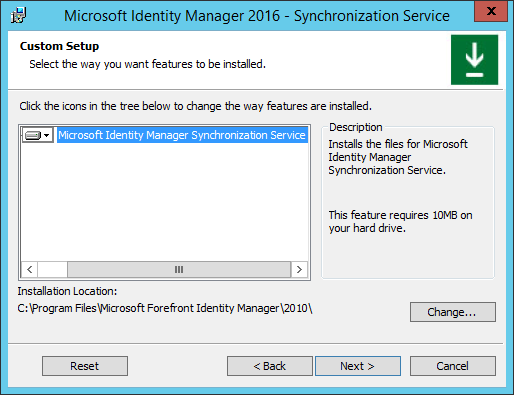
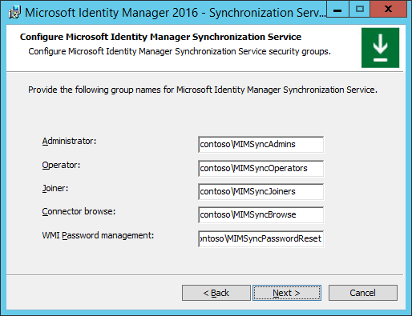
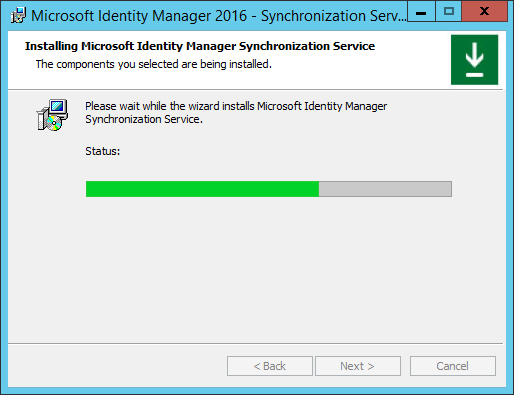

# Installing MIM 2016: MIM Synchronization Service

>[!div class="step-by-step"]
[Previous](https://docsmsftstage.azurewebsites.net/MIM/DeployUse/prepare-server-exchange.html)
**Preparing an identity management server: Exchange (optional)**

> [!NOTE]
> In all the examples below, **mimservername** represents the name of your domain controller, **contoso** represents your domain name, and **Pass@word1** represents an example password.

To install Microsoft Identity Manager 2016 components, first:

1. Sign in as *contoso\Administrator* to the CORPIDM server you are using for identity management.

2. Unpack the MIM installation package or mount the MIM image DVD.

## Install MIM 2016 Synchronization (Sync) Service

1. In the unpacked MIM installation folder, navigate to the **Synchronization Service** folder.

2. Run the **MIM Synchronization Service installer**. Follow the guidelines of the installer and complete the installation.

3. In the welcome screen – click **Next**.

    

4. Review the license terms and if you accept them, click **Next**.

5. On the **Custom Setup** screen click **Next**.

    

6.  In the Sync database configuration screen, select:

    1.  The SQL Server is located on: **This computer**.

    2.  The SQL Server instance is: **The default instance**.

    

7.  Configure the Sync Service Account according to the account you created earlier:

    1.  Service account: *MIMSync*

    2.  Password: *Pass@word1*

    3.  Service Account Domain or local computer name: *contoso*

    

8.  Provide MIM Sync installer with the relevant security groups:

    1.  Administrator = *contoso\MIMSyncAdmins*

    2.  Operator= *contoso\MIMSyncOperators*

    3.  Joiner = *contoso\MIMSyncJoiners*

    4.  Connector Browse = *contoso\MIMSyncBrowse*

    5.  WMI Password Management= *contoso\MIMSyncPasswordReset*

    

9. In the security settings screen, check **Enable firewall rules for inbound RPC communications**, and click **Next**.

10. Click **Install** to begin the installation of MIM Sync.

    1.  A warning concerning the MIM Sync service account may appear – click **OK**.

    2.  MIM Sync will now be installed.

        

    3.  A notice on creating a backup for the encryption key will be shown – click **OK**, then select a folder to store the encryption key backup.

        

    4.  When the installer successfully completes the installation, click **Finish**.

        

    5.  You will be prompted to sign out and sign in for the group membership changes to take effect. Click **Yes** to sign out.

>[!div class="step-by-step"]  
[Next](https://docsmsftstage.azurewebsites.net/MIM/DeployUse/mim-install-service-portal.html)
**Installing MIM 2016: MIM Service and Portal**
