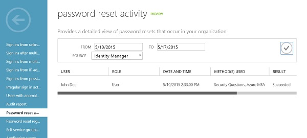
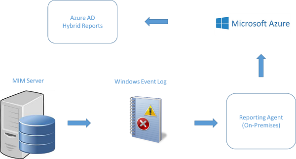

# Identity Manager Hybrid Reporting in Azure
If you have an Azure subscription, you can now easily create a report of events that are both on-premises and in the cloud. The reports can then be viewed in the Azure portal. Better yet, the reports are combined with the Azure Active Directory activities. With Identity Manager Hybrid Reporting, Azure AD management portal can display identity management activity reports for both cloud and on-premises activities. This reporting capability provides the following:

-   Your experience is unified: unified reports for IAM activities, for both cloud and an on-premises

-   Your cost is reduced: Eliminating the need for on-premises reporting data-warehouse infrastructure

-   Your data is yours: The reporting data can be easily exported from the on-premises Identity Manager or from Azure AD and can be used to generate custom view reports

## What is Azure AD Hybrid Reporting?
With Hybrid reporting, Azure AD management portal can display unified identity management activity reports. This is regardless to where the activity was carried out, identity manager or Azure AD. For example, if you want to know who registered to self-service password reset (SSPR) in the last month, you can see it all in Azure AD management portal. In this report you will see users who registered to SSPR in both the applications access panel (myapps.microsoft.com) and Identity Manager.

## Why should I use Identity Manager Activity Reports in Azure AD?
Hybrid reporting helps IT professionals address some common identity management reporting challenges.

1.  Report identity management activities that were performed in different systems: Now you can see identity management reports from activities on Azure AD and Identity manager in Azure AD management portal.

2.  Export reporting data and create custom reports: In addition to reports in Azure AD, with this new capability we have added windows events that reflect the Identity Manager activity. This makes it much easier than before to integrate to SIEM systems, view the Identity Manger activity and create custom reports.

3.  Minimize the reporting system infrastructure cost: deploying this new capability will require a few minutes of your time. All you have to do is to install a reporting agent on the Identity Manager server.

The reporting agent is downloaded from the Azure AD management portal, in the directory configuration screen:

## How does it work?
After the reporting agent is installed, the activity data of Identity Manager is sent to the Windows Event Log. The reporting agent processes the events and uploads them to Azure. In Azure the activity data is stored, currently for one month. When retrieving the report, the activity events are parsed and filtered for the required reports. Finally, the Azure management portal retrieves the reporting data and renders this as the activity report.

