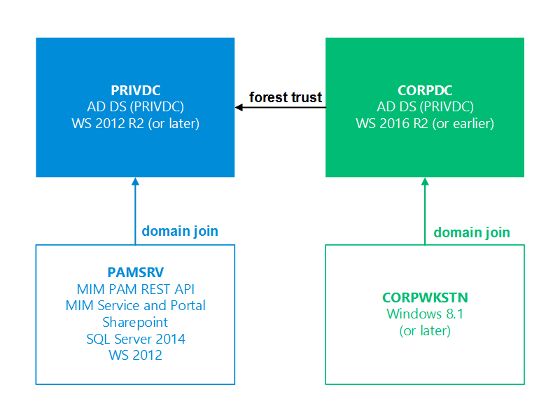

---
# required metadata

title: PAM environment overview | Microsoft Identity Manager
description: Find the required number and configuration of virtual machines to successfully deploy Privileged Access Management
keywords:
author: kgremban
ms.author: kgremban
manager: femila
ms.date: 07/15/2016
ms.topic: article
ms.service: microsoft-identity-manager
ms.technology: active-directory-domain-services
ms.assetid: 479db14c-1bfb-4d7c-a344-cd718a01f328

# optional metadata

#ROBOTS:
#audience:
#ms.devlang:
ms.reviewer: mwahl
ms.suite: ems
#ms.tgt_pltfrm:
#ms.custom:

---

# Environment overview

Privileged Access Management works with virtual machines (VMs) with separate drives that are connected to each other on a shared network. These virtual machines can be hosted by Windows 8.1, Windows Server 2012 R2, or other operating system platforms.

You will need a minimum of three virtual machines.  If you don't already have an AD domain for PAM to manage, you will need one additional VM to act as a CORP domain controller.  If you wish to configure the PRIV software for high availability, you will also need two additional VMs.

The drives where the virtual machine disk images will be stored need at least 120 GB of free disk space to hold all the VMs.  If you plan to deploy for high availability, make sure that the disk subsystem meets the requirements for SQL shared storage.  The shared storage can be in the form of Windows Server Failover Clustering cluster disks, disks on a Storage Area Network (SAN), or file shares on an SMB server. Note that these must be dedicated to the bastion environment; sharing storage with other workloads outside of the bastion environment is not recommended as it could jeopardize the integrity of the bastion environment.

> [!NOTE]
> The current MIM customer technical preview (CTP) is not compatible with the database or directory contents from the previous CTP. If you have been previously evaluating MIM for PAM or other scenarios, please back up and archive the virtual machines used for that test, and start the deployment with new virtual machine images that have not previously be used for MIM scenarios.
