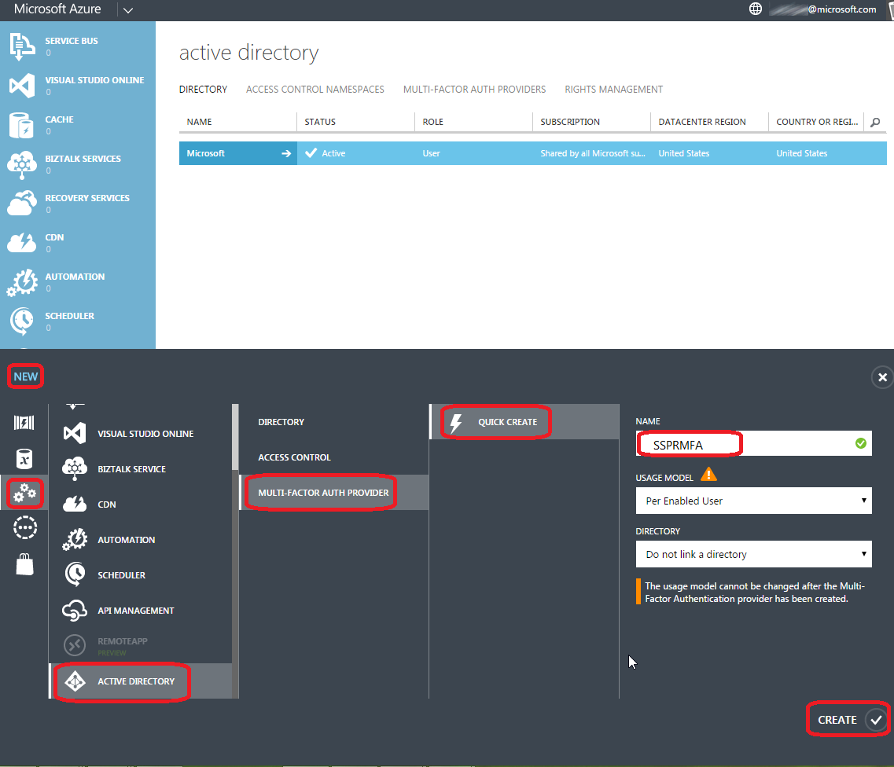
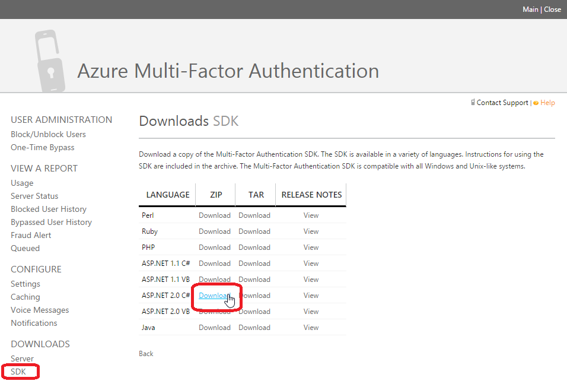
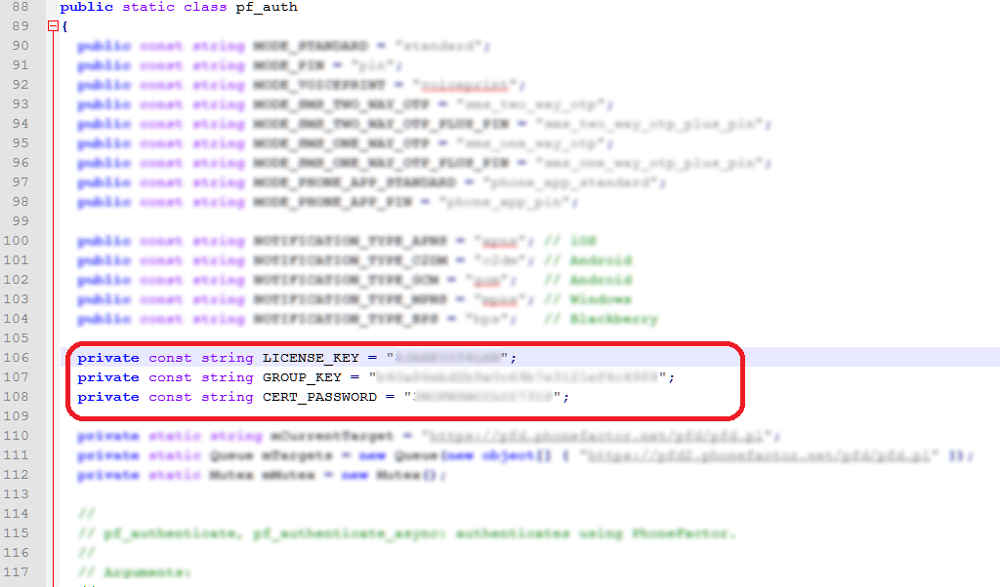
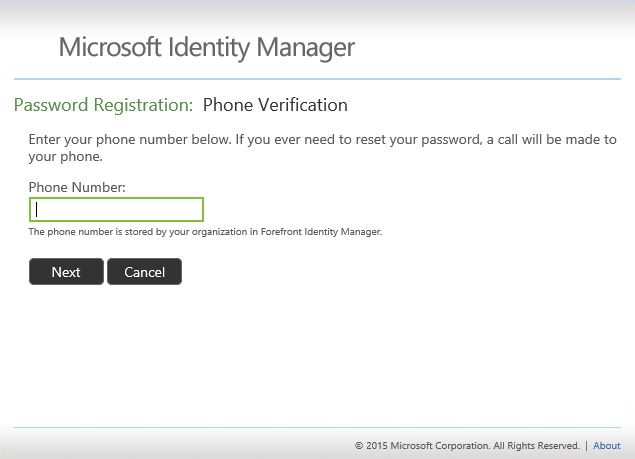
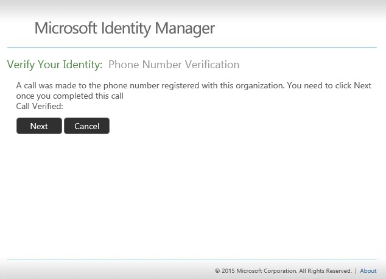

# Setting Up Self-Service Password Reset and Account Unlock
MIM now enables you to enable Multifactor Authentication (MFA) for user password reset. That means that when a user resets his password right before he goes on vacation, and has no recollection of what it was when he gets back, all he needs is his mobile phone and he’s up and running in no time.

The latest MIM self-service password reset (SSPR) authentication gate is great news, especially for users who are always forgetting their passwords, and for their admins. MIM makes it really easy for users to reset their passwords without having to call the help desk or remember the answers to the questions in the QA gate, which can be as complicated as remembering the original password.

With the new MFA gate  authentication can rely on answering the phone and optionally clicking a PIN code. This topic gives you instructions for how to set it up and make it work.

## Getting the MFA gate to work
Like all of the MIM SSPR gates, the setup of the MFA gate is very simple and involves a few steps that are explained here.

> [!NOTE]
> If you don’t work with Windows Azure, then you can use custom applications and directories to set up your MFA provider, or you can use the MFA gate with on-premises applications using a multi-factor authentication server, but this topic only provides instructions for working with Azure Active Directory.

#### Configure the MFA gate

1.  In IDWeb, click on **Workflows** in the left pane.

    

2.  Check **Password Reset AuthN Workflow**.

    

3.  Click on the **Activities** tab and then scroll down to **Add Activity**.

4.  Select **MFA Gate**, click **Select** and then **OK**.

#### Register your multifactor authentication provider in Azure

1.  Set up your MFA provider in Windows Azure Active Directory. That generates a file that includes some keys that you need to update in the MIM config file, giving it MFA information.

    Log into the Azure portal using your credentials.

2.  In the bottom left hand corner, click **New**.

3.  Click **App Services &gt; Active Directory &gt; Multi-Factor Auth Provider &gt; Quick Create**.

4.  In the **Name** field, enter **SSPRMFA** and click **Create**.

    

5.  Click **Active Directory** in the Azure Portal menu, and then click the **Multi-Factor Auth Providers** tab.

6.  Click on **SSPRMFA** and then click **Manage** at the bottom of the screen.

    

7.  In the **Azure Multi-Factor Authentication** window that opens, click **SDK** under **Downloads** in the menu at the left.

8.  Click **Download** for the **SDK for ASP.net 2.0 C#**.

    

9. Save and open the zip file.

#### Update the configuration file

1.  In the SDK zip file, in the folder \pf, open the file **pf_auth.cs**.

2.  Find these three parameters: `LICENSE_KEY, GROUP_KEY, CERT_PASSWORD`.

    

3.  In **C:\Program Files\Microsoft Forefront Identity Manager\2010\Service**, open the file: **MfaSettings**.xml.

4.  Copy the values from the `LICENSE_KEY, GROUP_KEY, CERT_PASSWORD` parameters in the pf_aut.cs file into their respective xml elements in the MfaSettings.xml file.

5.  In the SDK zip file, under \pf\certs, extract the file **cert_key.p12** and enter the full path to it in the MfaSettings.xml file into the `<CertFilePath>` xml element.

6.  In the `<username>` element enter any username.

7.  Save the MfaSettings.xml file with the same name in the same location.

#### Get users to enter phone numbers

1.  Then get your users to enter their phone numbers so the system knows how to call them.

    They need to enter the Password Registration Portal and authenticate using their username and password.

2.  In the **Phone Number** field, they have to enter a country code, a space, and the phone number and click **Next**.

    

## Now that it’s up and running, how does it work?
Now that everything is configured and it’s running, you might want to know what your users are going to have to go through when they reset their passwords right before a vacation and come back only to realize that they completely forgot their passwords.

#### How a user resets his password

1.  The user goes to the Self Service Password Reset portal, and enters his username and clicks **Next**.

    

2.  In the background, what’s happening is that Azure MFA then places a phone call to the number the user gave when he signed up back in June when that great vacation in Hawaii was only a speck in the distant future.

3.  When the user answers the phone, he will be asked to press the pound key # on the phone. Then he clicks **Next** in the portal.

    

    If you set up other gates as well, the user will be asked to provide more information in subsequent screens.

    > [!NOTE]
    > If he’s impatient and clicks **Next** before pressing the pound key #, authentication fails.

4.  Then the user has to enter a new password twice, and the password is reset.
