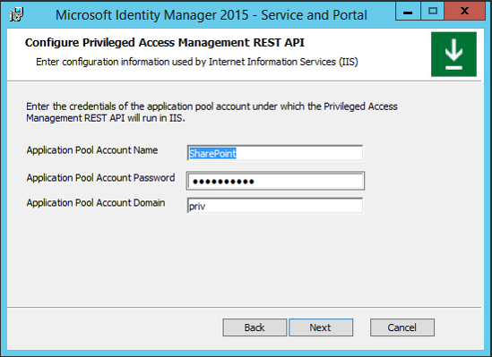
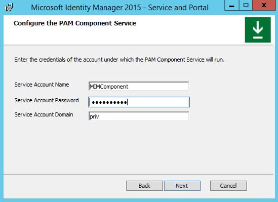

---
# required metadata

title: Step 4 – Install MIM components on PAM server and workstation | Microsoft Identity Manager
description:
keywords:
author: 
manager: stevenpo
ms.date: 04/28/2016
ms.topic: article
ms.prod: identity-manager-2015
ms.service: microsoft-identity-manager
ms.technology: active-directory-domain-services
ms.assetid: ef605496-7ed7-40f4-9475-5e4db4857b4f

# optional metadata

ROBOTS: noindex,nofollow
#audience:
#ms.devlang:
ms.reviewer: mwahl
ms.suite: ems
#ms.tgt_pltfrm:
#ms.custom:

---

# Step 4 – Install MIM components on PAM server and workstation

1.  On *PAMSRV*, log in as *PRIV\Administrator* to be able to install MIM Service and Portal and the sample portal web application. (Note that you must be a domain administrator; if you are not running the following commands as a domain administrator, the subsequent trust validation checks in the next step will not be completed.)

2.  If you have downloaded MIM, unpack the MIM installation archive to a new folder.

3.  Run the Service and Portal install program.  Follow the guidelines of the installer and complete the installation.

    1.  When selecting component features, it is necessary to include the following:

        -   MIM Service (including Privileged Access Management, not including MIM Reporting)

        -   MIM Portal

            

    2.  When configuring common services and the MIM database connection, specify “Create a new database”.

    3.  When configuring a mail server connection, set the mail server to “*corpdc.contoso.local*” and uncheck the “Use SSL” and “Mail Server is Exchange Server 2007 or Exchange Server 2010” checkboxes.

    4.  Specify to generate a new self-signed certificate.

    5.  Specify the Service Account Name as “*MIMService*”, and the Service Account Password as “*Pass@word1*” (the password specified in step 2 above), Service Account Domain as “PRIV” and the Service Email Account as “*MIMService@priv.contoso.local*”.

    6.  Accept the defaults for the synchronization server hostname and specify the MIM Management Agent account as “*PRIV\mimma*”.  Note that a warning message will appear that the MIM synchronization service does not exist.  This is OK, since the MIM synchronization service is not used in this TLG scenario.

    7.  Specify “*pamsrv*” as MIM Service server address.

    8.  Specify "*http://pamsrv.priv.contoso.local:82*" as the SharePoint site collection URL.

    9. Leave the registration portal URL blank.

    10. Select the checkbox to Open ports 5725 and 5726 in the firewall, and the checkbox to grant all authenticated users access to the MIM portal site.

    11. Leave the PAM REST API hostname empty , and specify 8086 as the port number (as described in the screenshot below):

        

    12. Configure the MIM PAM REST API account to use the same account as SharePoint (as the MIM Portal is co-located on this “*SharePoint*”, and the Application Pool Account Password as “*Pass@word1*” (the password specified in step 2 above), and the Application Pool Account Domain as “*PRIV*”.

        

        Note that a warning may appear that the Service Account is not secure in its current configuration.

    13. Configure the MIM PAM component service. Specify the account name as “*mimcomponent*”, and the Service Account Password as “*Pass@word1*” (the password specified in step 2 above), and the Service Account Domain as “*PRIV*”.

        

    14. Configure PAM Monitoring service. Specify the account name as “*mimmonitor*”, and the Service Account Password as “*Pass@word1*” (the password specified in step 2 above), and the Service Account Domain as “*PRIV*”.

        

    15. On the page Enter Information for MIM Password Portals, leave checkboxes empty and continue.  Then click **Next** to continue the installation.

4.  After installation completes, the server will reboot, then verify that the MIM Portal is active and enable users to view their own object resource in MIM.

    -   After PAMSRV reboots, log on as PRIV\Administrator.

    -   Launch Internet Explorer and connect to the MIM Portal on “*http://pamsrv.priv.contoso.local:82/identitymanagement*”.

        Note there may be a short delay the first time this page is located.

    -   If necessary, authenticate as PRIV\Administrator to Internet Explorer.

    -   In Internet Explorer, open the **Internet Options**, change to the **security tab**, and add the site to the “*Local intranet*” zone if it is not already there.  Close the Internet Options dialog.

    -   Using Internet Explorer to view MIM Portal, click on “Management Policy Rules”.

    -   Search for the management policy rule User management: *Users can read attributes of their own*.

    -   Select this management policy rule, uncheck “**Policy is disabled**”, click **OK** and then click **Submit**.

5.  Verify that the firewall allows incoming connections to TCP port 5725, 5726, 8086 and 8090.

    1.  Launch **Windows Firewall with Advanced Security** (located in Administrative Tools)

    2.  Click on **Inbound Rules**.

    3.  Verify that two rules “*Forefront Identity Manager Service (STS)*” and “*Forefront Identity Manager Service (Webservice)*” are listed.

    4.  Click **New rule**, select **Port**, select **TCP**, and type the specific local ports 8086, 8090.   Click through the wizard accepting the defaults, give the rule a name and click **Finish**.

    5.  After completing the wizard and close the Windows Firewall application.

    6.  Launch **Control Panel**.

    7.  Click on "**View network status and tasks**", located under "**Network and Internet**".

    8.  Verify that there is an active Network which is listed as being “*priv.contoso.local*” as a “*Domain network*”.

    9. Close **Control Panel**.

6.  From the sample web application archive, (download the archive from [Identity Management samples](https://github.com/Azure/identity-management-samples)) unpack the contents of the folder identity-management-samples-master\Privileged-Access-Management-Portal\src into a new folder Privileged Access Management Portal within the folder C:\Program Files\Microsoft Forefront Identity Manager\2010.

7.  Install and configure the sample web application for the MIM PAM REST API.

    1.  Create new web site in IIS with a site name of "*MIM Privileged Access Management Example Portal*", physical path "C:\Program Files\Microsoft Forefront Identity Manager\2010\Privileged Access Management Portal" and port 8090.  This can be done using the following PowerShell command:

        ```
        New-WebSite -Name "MIM Privileged Access Management Example Portal" -Port 8090   -PhysicalPath "C:\Program Files\Microsoft Forefront Identity Manager\2010\Privileged Access Management Portal\"
        ```

    2.  Enable the sample web application to be able to redirect users to the MIM PAM REST API. Using a text editor such as Notepad, edit the file “*C:\Program Files\Microsoft Forefront Identity Manager\2010\Privileged Access Management REST API\web.config*”. In the *&lt;system.webServer&gt;* section, add the following lines:

        ```
        <httpProtocol>
                <customHeaders>
        <add name="Access-Control-Allow-Credentials" value="true"  />
        <add name="Access-Control-Allow-Headers" value="content-type" />
        <add name="Access-Control-Allow-Origin" value="http://pamsrv:8090" />  
                </customHeaders>
        </httpProtocol>
        ```

    3.  Configure the sample web application. Using a text editor such as Notepad, edit the file "C:\Program Files\Microsoft Forefront Identity Manager\2010\Privileged Access Management Portal\js\utils.js". In that file, set the value of pamRespApiUrl to "http://pamsrv.priv.contoso.local:8086/api/pamresources/".

    4.  Restart IIS so these changes take effect.

        ```
        iisreset
        ```

    5.  (Optional) verify that the user can authenticate to the REST API. Open a web browser, as the administrator on *pamsrv*.  Navigate to the web site URL *http://pamsrv.priv.contoso.local:8086/api/pamresources/pamroles/* authenticate (if needed), and ensure that a download occurs.

8.  Install the MIM PAM requestor cmdlets on the workstation.

    1.  Log into CORPWKSTN as an administrator.

    2.  Download the **Add-ins and extensions** to the CORPWKSTN computer, if not already present.

    3.  Unpack from the archive the folder Add-ins and extensions to a new folder.

    4.  Run the installer **setup.exe**.

    5.  On the custom setup, specify the PAM Client is to be installed, but not the MIM Add-in for Outlook or the MIM Password and Authentication Extensions.

    6.  On the PAM Server address, specify as the hostname of the PRIV MIM server *pamsrv.priv.contoso.local*.

9. After the installation completes, restart CORPWKSTN to complete the registration of the new PowerShell module.
